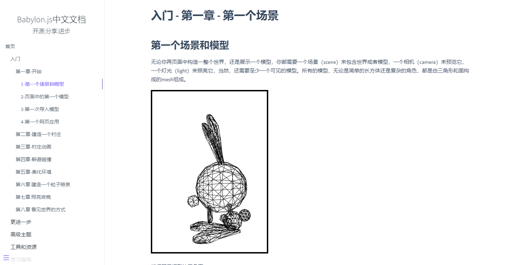

babylon.js中文文档
=========

这是一个文档翻译项目，原英文内容来自[babylon.js官方文档](https://doc.babylonjs.com/)。

目前网上的babylon.js中文文档，存在版本太老、更新不及时、内容不全等问题。本项目通过翻译babylon.js的指南性文档，意在：

* 帮助不熟悉babylon.js的同学快速上手
* 系统性了解babylon.js的API封装方式，获得启发或指导
* 学习技术化的文档语言
* 翻译过程中，提高英中文档翻译能力

文档翻译过程也是一个学习和共享的过程，希望有意共同学习babylon.js的同学，可以利用空闲时间一起协作开发本项目。协作开发前，请务必阅读本文末尾的**开发规范**

### 阅读方式

*本项目正在开发中，所以会有部分文档暂未翻译，敬请谅解*

* 借由[docsify](https://docsify.js.org/)的强大能力 :thumbsup: ，本文档可以直接[在线阅读](https://shawn0326.github.io/babylon-doc-cn/)。

* 在git仓库页面直接[阅读](./docs/README.md)
* Clone本项目，在本地阅读
### 一些简单的开发规范

* 暂时只翻译 `Getting Started`, `Diving Deeper`, `Advanced Topics`, `Tools and Resources`, `Guided Learning`, `Extensions` 这几部分，API文档内容过多暂不翻译
* babylon.js的指南文档是树形标题结构。有子级的标题需要创建文件夹，以标题作为文件夹名称；没有子级的标题直接创建`markdown`文件，以标题作为`markdown`文件的文件名；有些父级标题本身有一些内容描述，可以在该标题的文件夹中创建`README.md`翻译该内容描述
* 文档中涉及的图片、链接等一律使用外链，不要下载到本项目中
* 文档中代码块遵循`markdown`代码块书写规范
* 翻译顺序不作强制要求，可以只翻译自己感兴趣的部分
* 为了避免冲突，建议一篇文档由一个开发者首先完成。开发者可以先创建文件并在文件开头添加 `TODO + 作者` 的标识，表示希望开始这篇翻译工作
* 翻译完成后，就可以移除`TODO`的标识了，这时其它的开发者可以针对该篇文档进行修饰性更改
* 不求逐字句翻译，尽量准确表达出意思，易于阅读即可。文档中某些冗余的内容可以直接概括
* 术语和特定类名不要翻译
* 文档中的跳转路径均使用相对路径
* 每级目录中的`_sidebar`文件用于网页版的侧边栏导航，编写规则详见[docsify使用文档](https://docsify.js.org/#/zh-cn/more-pages?id=%e5%ae%9a%e5%88%b6%e4%be%a7%e8%be%b9%e6%a0%8f)。